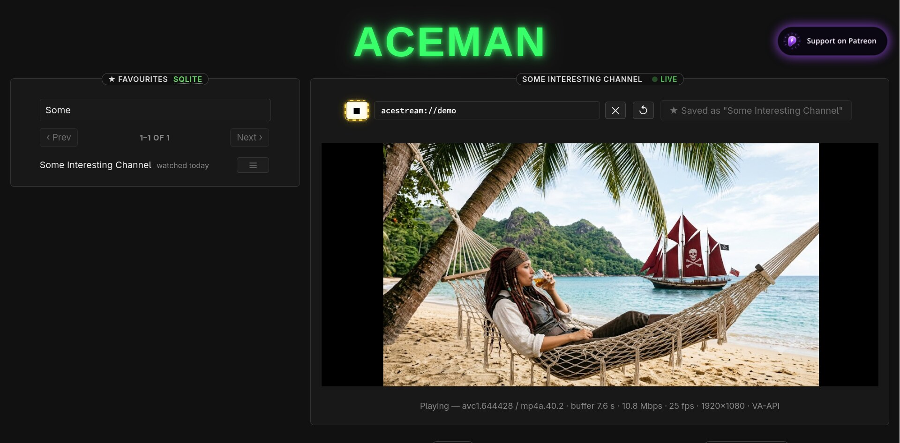
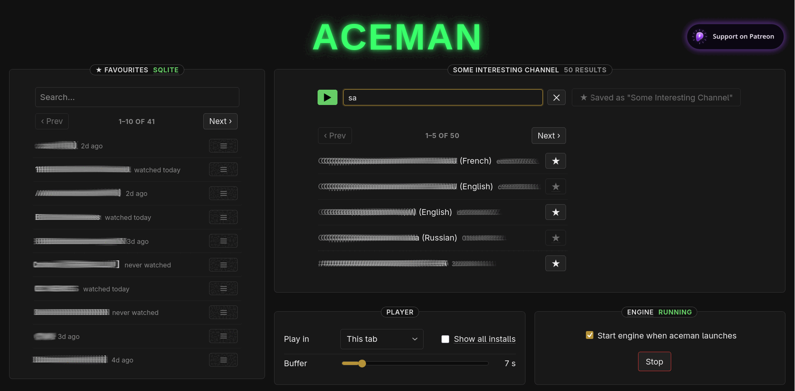
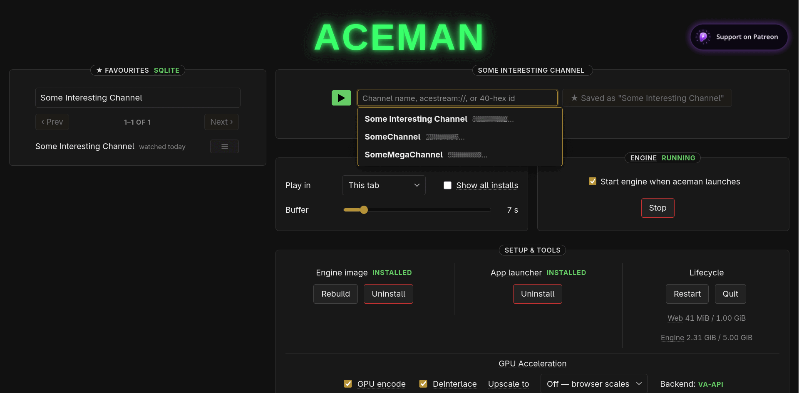
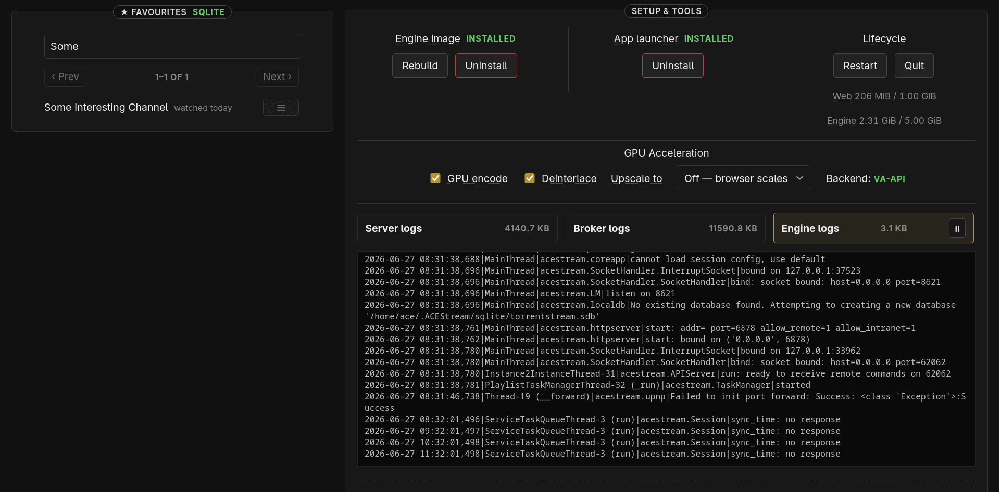
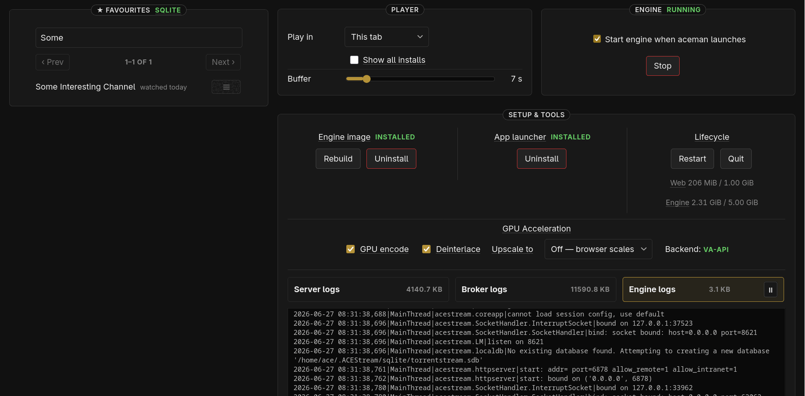

<p align="center">
  
</p>

<h1 align="center">aceman</h1>

<p align="center">
  <a href="https://github.com/curiousconcept/aceman/actions/workflows/broker.yml"></a>
  <a href="https://github.com/curiousconcept/aceman/actions/workflows/web.yml"></a>
  <a href="https://github.com/curiousconcept/aceman/actions/workflows/js.yml"></a>
</p>

Watch [Ace Stream](https://acestream.org) content from a **sandboxed
engine** — a rootless Podman container, managed and played through a
browser UI (a stdlib-Python web app), or with playback delegated to your
own Linux VLC/mpv (Flatpak supported). The browser app has **Favourites**,
watch **History**, built-in stream **Search** (a server-side proxy to
`search-ace.stream`), and an adjustable playback **buffer**. Close the tab
and it **auto-shuts down** — after a
short idle timeout the web server stops itself and the engine container,
so nothing keeps running (or eating bandwidth) in the background. A
host-side allow-list broker means the web never touches `podman` or
anything host-related directly.

<p align="center">
  <a href="https://www.patreon.com/cw/curiousconcept"></a>
</p>

## Screenshots

<p align="center">
  
</p>

<table>
  <tr>
    <td width="50%" valign="top">
      <br>
      <sub><b>Search + favourites</b> — search streams, save channels to a local list.</sub>
    </td>
    <td width="50%" valign="top">
      <br>
      <sub><b>History + tools</b> — recent-channel autocomplete, engine/app launcher, lifecycle.</sub>
    </td>
  </tr>
  <tr>
    <td width="50%" valign="top">
      <br>
      <sub><b>Config + live logs</b> — GPU acceleration, and tailed server / broker / engine logs.</sub>
    </td>
    <td width="50%" valign="top">
      <br>
      <sub><b>Player + buffer</b> — choose where playback opens and tune the buffer.</sub>
    </td>
  </tr>
</table>

## Capabilities by OS

| Capability                              | Linux | Windows (WSL2)            | macOS |
|-----------------------------------------|:-----:|:------------------------:|:-----:|
| Sandboxed engine (rootless Podman)      |  ✅   | ✅ (inside WSL)          |  —    |
| Web UI (browser playback)               |  ✅   | ✅ (served to Windows)   |  —    |
| External-player CLI (`aceman` + VLC/mpv)|  ✅   | ✅ via `get_url_stream` → Windows VLC/mpv (GPU) |  —    |
| `acestream://` desktop handler          |  ✅   | ✅ opt-in (`register-handler`) |  —    |
| GPU / VA-API acceleration               |  ✅   | browser: server transcode on CPU (no VA-API in WSL) but decode on GPU · external Windows player: no transcode → full Windows GPU |  —    |
| One-click installer                     |  manual |  ✅ `wsl/install.bat`   |  —    |

## Quick start

### Linux

Requires rootless **Podman ≥ 4.0**, **Python ≥ 3.9** (stdlib only),
**bash ≥ 4**, and **curl** + **jq**. The web UI plays in your **browser**,
so **no media player is required** — a player is *optional*, only for the
external-player CLI path.

```bash
git clone https://github.com/curiousconcept/aceman.git
cd aceman
./check_install_dependencies.sh
```

`check_install_dependencies.sh` detects your package manager (apt,
dnf/yum, pacman, zypper, apk, rpm-ostree), installs anything missing,
and can finish by installing **mpv + VLC** — your choice of **Flatpak**
(locked down to **no filesystem access**: only network + audio + video,
all the external-player path needs) or **native** distro packages.

**One-time:** download the Ace Stream engine tarball (proprietary, not
shipped here) from **https://docs.acestream.net/products/#linux** — the
**Linux → Ubuntu, amd64 / py3.10** build — and save it as
`engine/container/dist/engine.tar.gz`. Or run **`./import_engine.sh`**: it
picks the `acestream…ubuntu…x86_64….tar.gz` out of your `~/Downloads` and
installs it there for you (offering to download it if it's missing).
Details + hash verification:
[`engine/container/README.md`](engine/container/README.md).

Then pick how you want to watch:

#### aceman web — browser playback (default)

Plays in your browser; no media player needed. Carries Favourites, watch
History, Search, and auto-shutdown when the tab closes.

```bash
./aceman_web                 # web UI  → http://127.0.0.1:8765/
./aceman_web --stop          # stop the web server and the engine
./aceman_web --hard-refresh  # drop cached images; rebuild on next launch
```

> After installing **App Launcher** (in the web UI), launch aceman from
> your normal OS app menu/search like any other app — on WSL, use the
> **aceman Desktop shortcut** (created by `shortcut.bat`, called by
> `install.bat`).

#### Watch on another device (phone, tablet, TV)

The engine normally listens on `127.0.0.1` only, so nothing off this
machine can reach it. To play a stream in VLC (or any HTTP player) on
another device on the same network, pick **"Another device (VLC etc.)"**
in the Player card's **Play in** list. A warning explains that this
exposes the engine on your network; confirm it and the card shows the
stream URL as a link, a Copy button, and a QR code. Open the URL in the
player on your phone/tablet — the QR is just the same URL, scan it to
skip typing.

The URL looks like `http://<this-machine-ip>:6878/ace/getstream?id=<id>`
and tracks the content id in the Watch box.

Choosing this target *is* the playback session — the device plays it
instead of this machine (the engine serves one stream at a time, so you
don't play locally and on the device at once). Switching back to another
player closes the exposure. There's also a manual **"Expose engine on
local network"** checkbox on the engine card if you just want the bind
open without the device UI.

Two things to know:

- **It widens access.** While exposure is on, anything on your local
  network can reach the engine, not just your tablet. Only use it on a
  network you trust.
- **It resets on restart.** The exposed bind is never saved — every
  `./aceman_web` launch starts loopback-only.

#### aceman — external-player CLI

Hands a stream straight to VLC/mpv and tears the engine session down
cleanly on exit, so nothing keeps seeding after the player closes. Needs
a player (the dependency script can install one).

```bash
./aceman <content_id>          # 40-hex id, acestream://…, or a saved fav name
./aceman --url <transport_url> # play a .acelive / transport URL
./aceman fav list              # list saved favourites
./aceman engine status         # container + API + memory + cache
```

#### Fedora / atomic: enabling H.264 for browser playback

Fedora — especially the atomic variants (Silverblue, Kinoite) — ships a
**codec-stripped ffmpeg** whose `libavcodec-free` has **no H.264**. Browser
playback then fails on every stream with `MEDIA_ERR_DECODE` /
`FFmpegDataDecoder: Couldn't open avcodec`. That's the **browser** unable to
decode H.264 — aceman is serving the stream fine. Two fixes:

**A — Flatpak browser (no host changes).** Flatpak Firefox/Chrome bundle
their own H.264:

```bash
flatpak install -y flathub org.mozilla.firefox
flatpak run org.mozilla.firefox http://127.0.0.1:8765/
```

**B — full ffmpeg on the host.** Enable RPM Fusion, then swap the stripped
libs for the full build (works on atomic via `override remove`):

```bash
# 1. enable RPM Fusion (free + nonfree), then reboot
rpm-ostree install \
  https://mirrors.rpmfusion.org/free/fedora/rpmfusion-free-release-$(rpm -E %fedora).noarch.rpm \
  https://mirrors.rpmfusion.org/nonfree/fedora/rpmfusion-nonfree-release-$(rpm -E %fedora).noarch.rpm
systemctl reboot

# 2. swap stripped → full ffmpeg, then reboot
rpm-ostree override remove \
  ffmpeg-free libavdevice-free \
  libavcodec-free libavfilter-free libavformat-free libavutil-free \
  libpostproc-free libswresample-free libswscale-free \
  --install ffmpeg --install ffmpeg-libs
systemctl reboot
```

If depsolve names another `*-free` package, add it to the remove list and
retry — that's the whole game.

### Windows (WSL2)

Grab the repo ZIP —
[direct download](https://github.com/curiousconcept/aceman/archive/refs/heads/main.zip) —
extract it, open the `wsl/` folder, then double-click `install.bat`
followed by `run.bat`. As on Linux, you'll do the **one-time engine
tarball download** (from
[docs.acestream.net](https://docs.acestream.net/products/#linux)) and
drop it into the clone — `wsl/README.md` shows the exact Windows path.
Prefer Windows VLC/mpv over browser playback? `get_url_stream.bat <id>`
hands a stream URL to your player. Full steps:
**[`wsl/README.md`](wsl/README.md)**.

### macOS

_Not supported yet._

## Dependencies

Deliberately small — beyond what your OS already ships, this is the whole list:

**On the host (installed once):**
- **Podman** (rootless) — the container runtime.
- **git**, **curl**, **jq** — used by the shell wrappers; usually already
  present on desktop Linux. On WSL, `install.bat` installs `podman git jq`
  for you.

Run [`check_install_dependencies.sh`](check_install_dependencies.sh) to
verify and install these in one step across apt / dnf / yum / pacman /
zypper / apk / rpm-ostree.

**Inside the container images (built locally — nothing else touches your host):**
- *aceman-web* image (`python:3.11-slim`): **ffmpeg** for the in-browser
  stream transcode, plus `mesa-va-drivers` / `libva-drm2` /
  `mesa-vulkan-drivers` for GPU-accelerated ffmpeg.
- *engine* image (`ubuntu:22.04`): `python3` plus the engine's own runtime
  libs — via **apt**: `python3-apsw`, `python3-lxml`, `python3-nacl`,
  `python3-setuptools`; via **pip (pinned)**: `pycryptodome==3.20.0` (pip
  is removed from the image afterwards). Plus the **Ace Stream engine
  tarball you supply**. These are the *engine's* dependencies, not ours.

**Vendored in-tree (version-pinned + SHA-256 checked):**
- **mpegts.js** (Apache-2.0) — browser playback. See
  [`web/ui/domains/playback/vendor/README.md`](web/ui/domains/playback/vendor/README.md).

**Optional:**
- **VLC** or **mpv** — only for the external-player path. In-browser
  playback needs no player, but the web UI's Play links can also
  **delegate** to an external player (via the `acestream://` handler), the
  same external-player path the `aceman` CLI uses.
  `check_install_dependencies.sh` can install them as Flatpaks locked to
  **no filesystem access** (`--nofilesystem=host:reset`) — aceman only
  feeds the player an HTTP stream URL, so it never needs disk.

**Our** code adds no `pip install`, no `npm install`, no lock files — the
web and broker are stdlib-Python only, and the host footprint is Podman
plus a couple of shell tools. The single pinned `pip install` above is the
*engine image's* exception, for the proprietary engine's own runtime.

## Documentation

| Topic                         | Doc                                                  |
|-------------------------------|------------------------------------------------------|
| Engine image (build/run/env)  | [`engine/container/README.md`](engine/container/README.md) |
| Web app (UI, endpoints, flags)| [`web/README.md`](web/README.md)                     |
| Broker (allow-list, socket)   | [`broker/README.md`](broker/README.md)               |
| CLI `aceman` + favourites     | [`docs/cli.md`](docs/cli.md)                          |
| Player buffering (VLC/mpv)    | [`docs/players.md`](docs/players.md)                  |
| Threat model                  | [`docs/security.md`](docs/security.md)               |
| Windows / WSL kit             | [`wsl/README.md`](wsl/README.md)                     |

## How it fits together

```
[shell wrappers] ─▶ [Python web (containerised)] ─▶ [broker (host allow-list)] ─▶ [podman]
                                                              │
                                                              ▼
                                                   [engine container: acestream]
```

The web sends one JSON action per line to the broker over a `0600` unix
socket; the broker owns every host-touching operation. That boundary is
the security model — see [`docs/security.md`](docs/security.md).

### Security note — the engine gateway

The Ace Stream engine's HTTP API (port `6878`) sends permissive CORS
(`Access-Control-Allow-Origin: *`, and it reflects the request `Origin`
with `Access-Control-Allow-Credentials: true`). If that port is published
on `127.0.0.1`, **any website you have open can reach it**: the page's
JavaScript runs on *your* machine, so `fetch('http://127.0.0.1:6878/…')`
hits your own loopback, and the open CORS lets the site read the replies
— it could fingerprint the engine or start streams (joining swarms on
your machine). Binding to loopback stops other *machines*, not your own
*browser*. We can't change the engine's headers (proprietary).

**So by default aceman never publishes the engine's port directly.** A
small **engine gateway** container fronts it: it publishes `6878`,
forwards to the engine over the internal bridge, and **refuses any request
carrying `Sec-Fetch-Site`** — a header every browser sends and page JS
cannot forge or remove, while native players (VLC, mpv, the `aceman` CLI)
never send it. So browsers are blocked; real players pass. It's a
transparent byte-splice, so streams/seek/throughput are unaffected. Even
the "open on another device" LAN toggle goes through the gateway, so a
browser on another LAN device is blocked too — only real players get in.

Opt out with `ACE_ENGINE_GATEWAY=0` to publish the engine's API straight
to the host like older versions (reachable from any browser — not
recommended). Defence-in-depth that still applies regardless:

- The exposure only existed **while a tab from a hostile site was open**;
  aceman's idle auto-shutdown also limits the window.
- **Chromium** browsers block localhost access via Private Network Access;
  **Firefox** does not — which is why the gateway matters most there.
- Container hardening limits what a *compromised* engine could do to your
  host (it can't reach host files outside the explicit mounts).

## Motivation

Built by someone security-conscious who doesn't want to guess what's
running on their machines. So aceman is a **safe project with minimal
dependencies** — not exposed to supply-chain attacks through a sprawling
dependency tree. It's built on **vanilla technologies**: standard-library
Python, plain shell, and dependency-free vanilla JavaScript, with the few
unavoidable third-party pieces vendored, version-pinned, and hash-checked.

**No prebuilt binaries, no Docker images — releases are source-only:
what you see is what you get: inspect, build, run.** And **Podman, not
Docker** — rootless and daemonless, so there's no privileged root daemon
to trust or to attack.

It also wraps the Ace Stream engine **at arm's length**: the engine stays a
separate, sandboxed, untrusted component behind a host-side allow-list — so
the project is insulated against future changes to the engine, and keeps
working even if upstream shifts, the original authors move on, or the
surrounding ecosystem falls into disarray. Few moving parts, all readable,
nothing that rots quietly.

## License

aceman's own code is **MIT** — see [`LICENSE`](LICENSE). Exceptions:

- **Ace Stream engine** — proprietary, not included; you download it
  yourself and it's governed by Ace Stream's own terms.
- **`web/ui/domains/playback/vendor/mpegts.min.js`** — bundled third-party library under
  **Apache-2.0** (see its header and [`web/ui/domains/playback/vendor/README.md`](web/ui/domains/playback/vendor/README.md)).

## Disclaimer

This project is an independent, open-source wrapper and automation utility.
It is **not affiliated with, endorsed by, or associated with Ace Stream**,
and it does **not bundle or distribute any proprietary software binaries or
copyrighted material** — the Ace Stream engine is downloaded by the user
from the official source, and any content you stream is your own
responsibility. "Ace Stream" and related marks belong to their respective
owners.

We are also **not affiliated with or endorsed by VLC (VideoLAN) or mpv**.
They're suggested throughout only because they're well established and play
Ace Stream output natively — not as any kind of partnership. "VLC",
"VideoLAN", "mpv", and related marks belong to their respective owners. If
another well-established, community-trusted player offers advanced features
worth supporting, suggestions are welcome.
